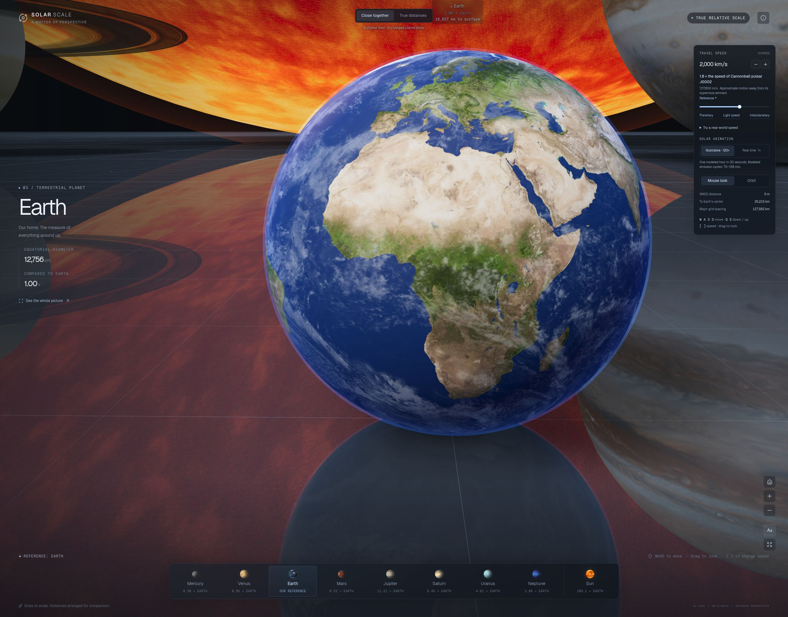
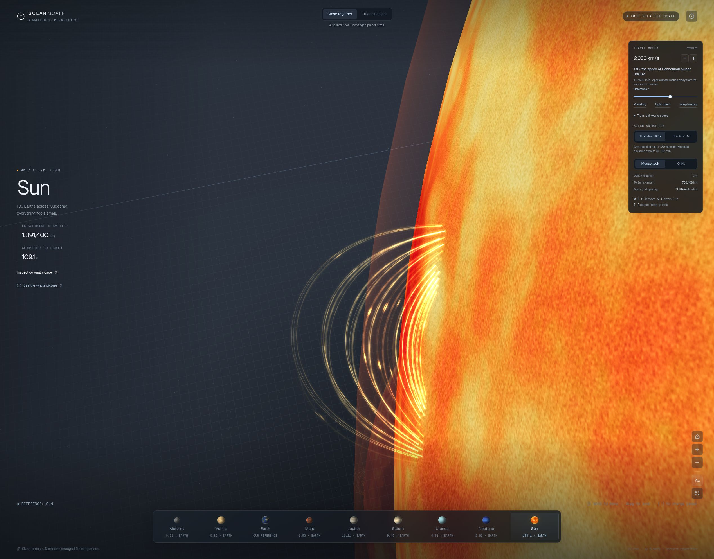
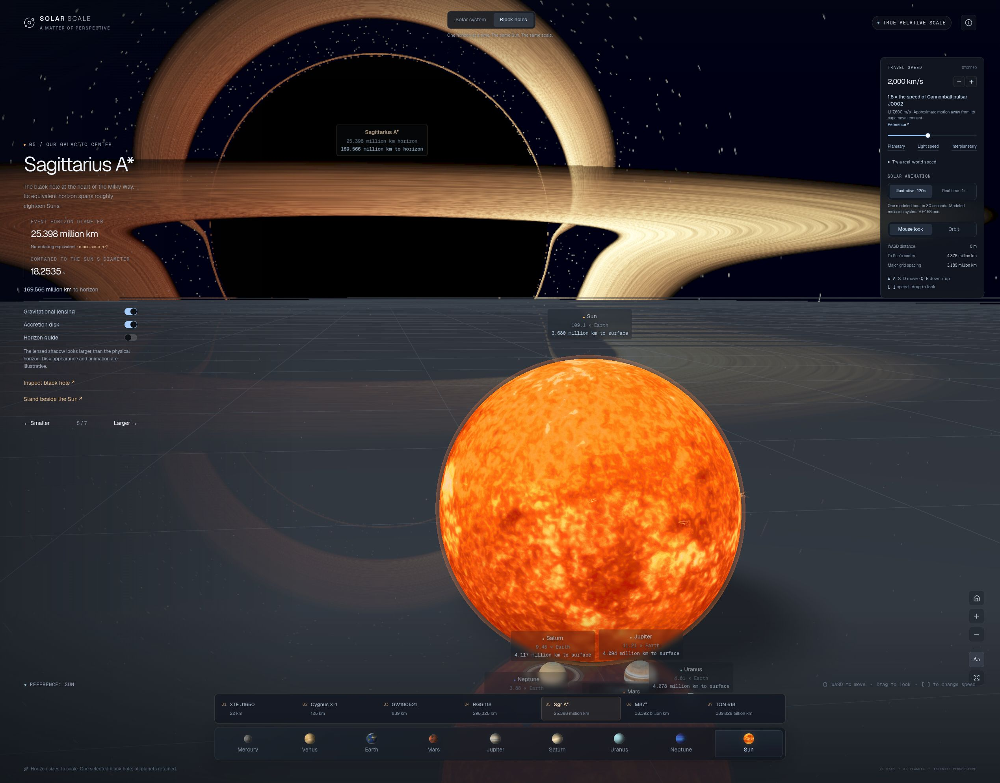

# Planetary Vis

**Stand beside Earth. Look up at the Sun. Feel the scale of the solar system.**

Planetary Vis is an interactive Three.js exhibit of the Sun and all eight planets at one consistent physical scale. Every body rests on the same reflective ground plane, giving your eye a shared reference for how large these worlds really are.



*The starting view: Earth fills the frame while the Sun looms overhead. Sizes are proportional; this close layout deliberately compresses the distances.*

## Explore

- **Close together:** an exhibition layout with space between planetary surfaces, including clearance for Saturn’s rings. The Sun can overhang the planets because its widest part is far above the floor.
- **True distances:** the same body sizes, arranged along a line at their mean distances from the Sun. Space gets very empty; labels help locate distant worlds.
- **Move at a known speed:** fly with WASD, change speed, and watch the distance travelled. Live comparisons connect your speed to a bullet, the Moon, Voyager, solar winds, stars, jets, and light.
- **Read distances in the scene:** planet labels display the camera’s distance to each surface; the travel panel separately reports distance to the selected body’s center.
- **Inspect the Sun:** a 4,096 × 2,048 surface texture, procedural fine detail, and 528 plasma strands grouped into eight coronal arcades. Choose **Sun → Inspect coronal arcade** to get close.



*The arcade close-up shows field-shaped strands, bright footpoints, and uneven emission. Orange colouring and brightness are enhanced for visibility, inspired by ultraviolet solar observations.*

## Black holes

Choose **Black holes** at the top to stand beside the detailed Sun with Sagittarius A* in the distance. All planets remain available in the lower dock. Choose **Inspect black hole**, **Smaller / Larger**, or any of the seven catalog entries to move from stellar to ultramassive scales.



The catalog contains XTE J1650−500, Cygnus X-1, GW190521’s remnant, RGG 118, Sagittarius A*, M87*, and TON 618. Each entry links to its mass source. XTE’s small-end estimate and TON 618’s large-end estimate are explicitly qualified; these are not definitive smallest/largest record claims.

- **Horizon size:** `2GM/c²`, using the IAU nominal solar mass parameter and exact speed of light. This is the nonrotating equivalent for each estimated mass, on the existing kilometer scale.
- **Lensing:** a numerical Schwarzschild null-geodesic shader bends light from the disk and background stars. The apparent shadow is larger than the physical horizon. Disable lensing for straight light paths, or enable the blue horizon guide to see the unlensed physical silhouette.
- **Disk:** an illustrative thin disk from 3 to 8 horizon radii, with differential rotation, brightness asymmetry, approximate Doppler/gravitational shifts, and multiple disk images. Disk extent, color, emission and animation are not observational reconstructions. Disks run at an illustrative pace independent of the solar animation clock; the global animation switch pauses both.
- **Navigation:** one selected black hole is placed in the exhibition at a time, with no rescaling of planets. Visits select a suitable starting speed. You can change it freely, up to 100 billion km/s in this mode. Camera distance to the horizon is shown in the label and information panel.
- **Rendering:** solar-system geometry stays at full display resolution. The lensing pass uses at most 1280 × 900 pixels. Distant subpixel planetary groups can be skipped; nearby Sun detail is retained. The floor and planets are an illustrative comparison stage, not matter in a relativistic simulation.

The independent ray integrator uses `p″ = −3 h² p / (2 |p|⁵)` in horizon-radius units, with finite-distance static-observer initialization and adaptive velocity-Verlet steps. It does not model Kerr spin, relativistic observer motion, full radiative transfer, or mutual gravity. References: [Bruneton’s Schwarzschild rendering paper](https://ebruneton.github.io/black_hole_shader/paper.pdf) and [NASA’s disk/lensing explanation](https://svs.gsfc.nasa.gov/14619/). No external shader code is bundled.

## Run locally

Requires **Node.js 22.13 or newer**, npm, and a browser with WebGL 2 and hardware acceleration. Node.js 24 or newer is recommended for running the TypeScript checks below.

```bash
git clone https://github.com/dackerman/planetary-vis.git
cd planetary-vis
npm ci
npm run dev
```

Open the local URL printed by the development server, normally **http://localhost:3000**. No API keys or external texture service are required; textures are included in the repository.

Prefer not to use Git? Download the repository ZIP from GitHub, extract it, and run `npm ci` and `npm run dev` in the extracted directory.

### Build a static site

```bash
npm run build
```

The deployable files are in **`dist/client/`**. The included `netlify.toml` configures this output directory and Node.js 24 for GitHub-connected Netlify builds. Serve that directory with a static HTTP server or upload it to a static host. For a quick local check, if Python 3 is installed:

```bash
python3 -m http.server 8000 --bind 127.0.0.1 --directory dist/client
```

Then open **http://localhost:8000**. Opening `index.html` directly as a `file://` URL is not supported. The app currently expects deployment at the domain root, rather than a GitHub Pages repository subpath.

The `.openai/hosting.json` file belongs to the original Sites deployment. It is not a credential or a prerequisite for a generic static host; do not reuse its project ID for your own Sites deployment. The GitHub repository is public; the original hosted exhibit’s access settings are managed separately.

## Controls

| Control | Action |
| --- | --- |
| **W / A / S / D** | Move forward, left, backward, right |
| **Q / E** | Move down / up |
| **Drag** | Look around in Mouse look mode; orbit in Orbit mode |
| **[ / ]** | Halve / double movement speed |
| **Speed slider and presets** | Choose a speed, including sourced real-world benchmarks |
| **+ / −** | Zoom in / out |
| **Home** | Return to Earth |
| **Planet buttons or labels** | Travel to that body |
| **See the whole picture** | Frame the current layout |
| **Sun → Inspect coronal arcade** | Inspect a solar active region up close |
| **Illustrative / Real time** | Run solar animation at 120× / 1× |
| **About → Animate surfaces, plasma & stars** | Pause or resume ambient animation |

The scene also has on-screen navigation controls. Reduced-motion preferences disable ambient animation initially. Movement is constrained above the floor and outside planetary surfaces, including at high travel speeds.

## What is physically scaled?

**One scene unit is 6,378.1 km**, Earth’s equatorial radius. Each planet uses its equatorial and polar radii, so the giant planets are visibly oblate rather than perfect spheres. Centers sit one polar radius above the floor.

| Property | Treatment |
| --- | --- |
| Sun and planet dimensions | One shared linear kilometer scale |
| Planet shapes | Equatorial and polar radii; upright display axes |
| Close layout | Deliberately arranged for comparison |
| True-distance layout | Mean Sun-to-body center distances, aligned in a row |
| Camera speed | Distance per simulated travel second, displayed in physical units |
| Surface distance | Closest distance to the displayed ellipsoid |
| Coronal strand widths | Approximately 200–460 km |
| Arcade heights in this model | Approximately 1,000–44,000 km |
| Solar animation | Modeled emission cycles of 70–158 minutes; 120× or real-time playback |

The true-distance layout is **not an ephemeris**: planets do not orbit in a straight line, and their real separations change continuously. Rotation, the ground, reflections, shadows, star twinkle, and exposure are presentation choices. Planet axes and Saturn’s rings are arranged for this exhibit.

Speeds above the speed of light are available for navigating enormous distances. This is a geometric visualization, not a relativistic travel simulator.

### How the coronal arcades work

Strands are traced through a local potential field from a buried bipolar pair, then mapped onto the spherical Sun. Nearby field lines form nested arches with anchored footpoints. Their geometry remains stable as staggered heating, cooling, and draining plasma change the emission.

The shader uses a simplified density-squared brightness model, a height-dependent density falloff, soft emission around strands, and cooling packets moving down both legs. These are physically motivated approximations, **not a full magnetohydrodynamic or radiative-transfer simulation**, and not a reconstruction of a particular observed active region. Fine surface detail is procedural. The false-colour rendering combines visual cues from different solar wavelengths rather than simulating one instrument passband.

Real time means one simulated second per elapsed second. Illustrative mode accelerates the same solar clock by 120×, so an hour passes in 30 seconds. Switching modes preserves the current animation state.

## Under the hood

Built with **Three.js**, **React 19**, **TypeScript**, **Vinext/Vite**, and **Tailwind CSS**, with accessible controls from Base UI/shadcn.

| File | Responsibility |
| --- | --- |
| [`lib/planets.ts`](lib/planets.ts) | Physical dimensions and layout coordinates |
| [`lib/observatory.ts`](lib/observatory.ts) | Scene, camera, reflections, labels, and animation loop |
| [`lib/navigation.ts`](lib/navigation.ts) | Movement, collision limits, units, surface distances |
| [`lib/coronal-field.ts`](lib/coronal-field.ts) | Bipolar field-line tracing |
| [`lib/solar-effects.ts`](lib/solar-effects.ts) | Surface detail, strand geometry, and plasma shaders |
| [`lib/speed-references.ts`](lib/speed-references.ts) | Speed benchmarks and source links |
| [`app/page.tsx`](app/page.tsx) | Controls, body information, and explanatory text |
| [`app/globals.css`](app/globals.css) | Interface styling |

Coronal strand geometry is merged so hundreds of strands can share a small number of draw calls. The scene uses logarithmic depth to accommodate planetary and interplanetary scales. Labels project from the same camera every rendered frame.

### Checks

```bash
npx tsc --noEmit
node --experimental-strip-types --test tests/*.test.ts
npm run build
```

The tests cover relative sizes, close-layout clearances, true-distance placement, movement speed and collision handling, and coronal field-line closure and scaling. Shader appearance still needs a browser check; a successful TypeScript build alone cannot catch every GLSL error.

## Troubleshooting

| Symptom | Try |
| --- | --- |
| Blank scene or WebGL warning | Enable hardware acceleration and use a WebGL 2-capable browser |
| Missing textures | Serve over HTTP from the domain root; confirm `public/textures/` was included in the build |
| Planets seem to disappear in True distances | Use a planet button or label; most bodies really are subpixel at an interplanetary overview |
| Motion is too slow or too fast | Adjust the speed slider or choose a real-world preset; Q/E also changes altitude |
| Low frame rate | Reduce the window size, close other GPU-heavy tabs, or pause ambient animation |

## Sources and asset credits

- Dimensions: [NASA Planetary Fact Sheets](https://nssdc.gsfc.nasa.gov/planetary/factsheet/) and [Sun Fact Sheet](https://nssdc.gsfc.nasa.gov/planetary/factsheet/sunfact.html).
- Textures: [Solar System Scope / INOVE](https://www.solarsystemscope.com/textures/), licensed under [CC BY 4.0](https://creativecommons.org/licenses/by/4.0/). File-level provenance and processing notes are in [`public/textures/ATTRIBUTION.md`](public/textures/ATTRIBUTION.md).
- Fine coronal structure: [NASA Hi-C observations](https://www.nasa.gov/solar-system/rocket-borne-telescope-detects-super-fine-strands-on-the-sun/).
- Shape and scale reference: [NASA/SDO — Raindrops Falling on the Sun](https://svs.gsfc.nasa.gov/11198).
- Heating and flows: [Antolin & Froment (2022)](https://doi.org/10.3389/fspas.2022.820116).
- Speed benchmarks link to their sources in the interface and in [`lib/speed-references.ts`](lib/speed-references.ts).

Screenshots show this application, including the credited texture assets. The source code does not currently specify a software license; public repository visibility does not change the separate asset licenses.

## About contributions

> *About Contributions:* Please don't take this the wrong way, but I do not accept outside contributions for any of my projects. I simply don't have the mental bandwidth to review anything, and it's my name on the thing, so I'm responsible for any problems it causes; thus, the risk-reward is highly asymmetric from my perspective. I'd also have to worry about other "stakeholders," which seems unwise for tools I mostly make for myself for free. Feel free to submit issues, and even PRs if you want to illustrate a proposed fix, but know I won't merge them directly. Instead, I'll have Claude or Codex review submissions via `gh` and independently decide whether and how to address them. Bug reports in particular are welcome. Sorry if this offends, but I want to avoid wasted time and hurt feelings. I understand this isn't in sync with the prevailing open-source ethos that seeks community contributions, but it's the only way I can move at this velocity and keep my sanity.
